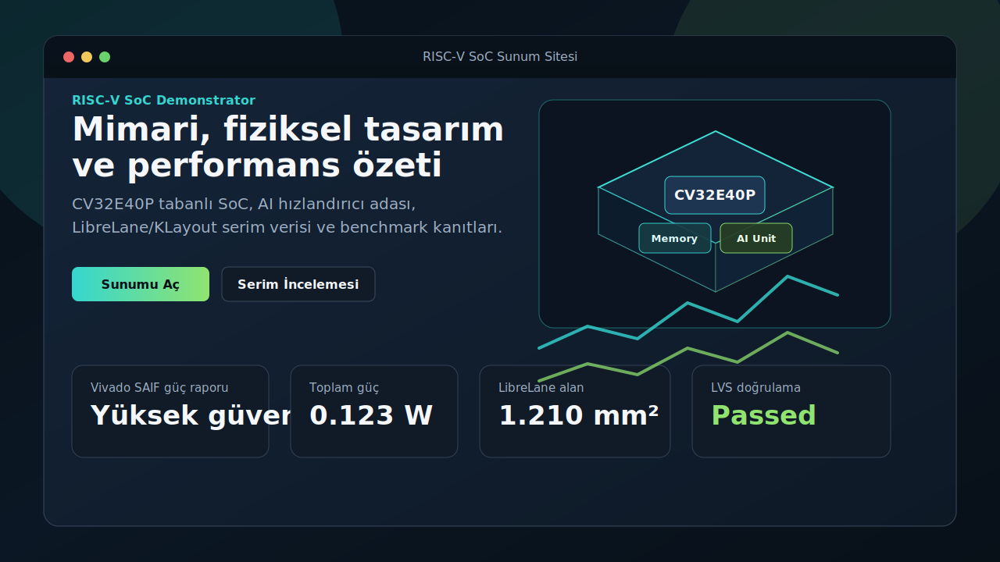

# 2026 Chip Design

RISC-V tabanli SoC, AI hizlandirici entegrasyonu, FPGA dogrulama akisi ve fiziksel tasarim sunum artefaktlarini bir araya getiren teknik calisma deposu.

Bu repo; RTL kaynaklarini, testbenchleri, benchmark yazilimini, Vivado dogrulama akisini ve GitHub Pages uzerinden yayinlanabilir interaktif sunum sitesini icerir. Amac, tasarimin mimari niyetini ve elde edilen dogrulama sonuclarini profesyonel ve incelenebilir bir paket olarak sunmaktir.

## Live Presentation

[](https://emirhanbeyaz.github.io/RISCV-TinyML_Chip_Design/)

Interaktif sunum GitHub Pages uzerinden yayinlanmak icin hazirdir:

```text
https://emirhanbeyaz.github.io/RISCV-TinyML_Chip_Design/
```

## Project Scope

- `CV32E40P` tabanli RISC-V SoC entegrasyonu
- Memory-mapped AI kontrol, yerel AI bellek alani ve UART tabanli veri yukleme akisi
- TinyConv benzeri RTL hizlandirici iskeleti ve Micro Speech referans akisi
- Icarus/Verilator tabanli RTL smoke testleri
- Vivado elaboration, synthesis, implementation ve guc analizi artefaktlari
- LibreLane/KLayout kaynakli fiziksel tasarim verilerinin 2.5D sunum modeli
- GitHub Pages uyumlu interaktif teknik sunum sitesi

Board uzerinde final urun bitstream'i, pin seviyesi bring-up ve final timing/power sign-off ayri faz olarak ele alinmalidir.

## Local Presentation

GitHub Pages yayini icin kok dizindeki `index.html` kullanilir. Sayfa, asagidaki interaktif paneli gomulu bir pencere olarak acar:

- [index.html](./index.html#L1)
- [site/sunum.html](./site/sunum.html#L1)
- [site/README.md](./site/README.md#L1)

Yerelde calistirmak icin:

```bash
python3 -m http.server 8080
```

Ardindan tarayicida ac:

```text
http://localhost:8080/
```

HTML dosyalarini dogrudan `file://` ile acmak onerilmez; KLayout JSON verileri tarayici tarafindan HTTP uzerinden yuklenir.

## Repository Layout

```text
.
|-- cv32e40p/                 # Upstream CV32E40P core
|-- index.html                # GitHub Pages entry page
|-- site/                     # Interactive presentation site
|   |-- assets/               # CSS and JavaScript
|   |-- layers_full.json      # KLayout 2.5D layer data
|   |-- detail_view.json      # Detailed layout view data
|   `-- librelane_outputs/    # Selected LibreLane reports and metrics
|-- soc/                      # RTL, testbenches, software and technical docs
|-- presentation_artifacts/   # Curated demo and benchmark evidence
|-- TEAM_GUIDE.md             # Contributor orientation
`-- README.md
```

Generated build products, simulator waveforms, Vivado logs and large intermediate layout outputs are intentionally excluded from version control.

## Verification

Primary regression:

```bash
make -C soc full
```

Benchmark smoke test:

```bash
make -C soc benchmark-smoke
```

Vivado smoke tests:

```bash
vivado -mode batch -source soc/vivado_smoke.tcl -tclargs xc7a35tcpg236-1 rtl
vivado -mode batch -source soc/vivado_smoke.tcl -tclargs xc7a35tcpg236-1 ooc
```

Presentation asset checks:

```bash
node --check site/assets/app.js
```

The repository also includes curated benchmark and presentation logs under [presentation_artifacts/](./presentation_artifacts/).

## Key Documentation

- [TEAM_GUIDE.md](./TEAM_GUIDE.md#L1)
- [soc/AI_RUNTIME_CONTRACT.md](./soc/AI_RUNTIME_CONTRACT.md#L1)
- [soc/AI_ACCELERATOR_STATUS.md](./soc/AI_ACCELERATOR_STATUS.md#L1)
- [soc/TFLM_MICRO_SPEECH_REFERENCE.md](./soc/TFLM_MICRO_SPEECH_REFERENCE.md#L1)
- [soc/AI_UART_PAYLOAD_PROTOCOL.md](./soc/AI_UART_PAYLOAD_PROTOCOL.md#L1)
- [soc/VIVADO_TEST_GUIDE.md](./soc/VIVADO_TEST_GUIDE.md#L1)
- [soc/VIVADO_IMPLEMENTATION_CHECKPOINT.md](./soc/VIVADO_IMPLEMENTATION_CHECKPOINT.md#L1)
- [soc/PROJECT_REMAINING_WORK.md](./soc/PROJECT_REMAINING_WORK.md#L1)

## Third-Party Sources

The project uses open-source RTL components including the upstream `CV32E40P` core and selected peripheral blocks. Attribution and source notes are maintained in:

- [soc/third_party/ATTRIBUTION.md](./soc/third_party/ATTRIBUTION.md#L1)

## Current Status

The repository is organized for technical review, presentation and continued development. Completed evidence includes RTL smoke tests, benchmark outputs, Vivado flow artefacts and LibreLane/KLayout-based physical design visualization. Remaining work focuses on board-specific constraints, final hardware bring-up, firmware-level end-to-end demos and final accuracy/performance sign-off.
